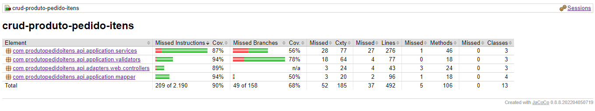

# Crud Produto/Serviço Pedido Itens

Este projeto é um CRUD (Create, Read, Update e Delete), construído para permitir que o usuário seja capaz de cadastrar um produto ou um serviço em um banco de dados PostgreSQL, cadastrar um pedido e adicionar itens nesse pedido, executando as operações de CRUD através de uma API REST.

## Tecnologias Utilizadas

- Java 17
- Spring Framework
- Spring Boot
- Spring Data JPA
- Maven
- Bean Validation
- QueryDSL
- PostgreSQL
- Docker
- REST com JSON
- JaCoCo

## Pré-requisitos

Certifique-se de ter instalado em sua máquina:
- Java JDK 11 ou superior
- Maven
- Docker
- Docker Compose

## Como Baixar o Repositório

1. Abra o terminal.
2. Clone o repositório usando o comando: `git clone https://github.com/vanderleik/crud-produto-pedido-itens.git`
3. Entre na pasta do projeto: `cd crud-produto-pedido-itens`

## Como Executar a Aplicação

1. Inicie os serviços necessários (como o banco de dados) usando Docker Compose: `docker-compose up -d`
2. Construa o projeto com Maven: `mvn clean install`
3. Execute a aplicação: `mvn spring-boot:run`

## Endpoints

Aqui você pode listar os endpoints disponíveis na aplicação:

### Order: API de pedidos 

- `GET
/api/v1/orders/{id}`
Endpoint responsável por buscar um pedido pelo id
- `PUT
/api/v1/orders/{id}`
Endpoint responsável por atualizar um pedido
- `DELETE
/api/v1/orders/{id}`
Endpoint responsável por deletar um pedido
- `GET
/api/v1/orders`
Endpoint responsável por listar todos os pedidos cadastrados no sistema
- `POST
/api/v1/orders`
Endpoint responsável por cadastrar um pedido no sistema
- `GET
/api/v1/orders/filter`
Endpoint responsável por buscar pedidos com filtros

### Itens: API de itens (Produtos e Serviços

- `GET
/api/v1/catalog-items/{id}`
Endpoint responsável por buscar um item pelo id
- `PUT
/api/v1/catalog-items/{id}`
Endpoint responsável por atualizar um item
- `DELETE
/api/v1/catalog-items/{id}`
Endpoint responsável por deletar um item do catálogo do sistema
- `GET
/api/v1/catalog-items`
Endpoint responsável por listar todos os itens cadastrados no sistema
- `POST
/api/v1/catalog-items`
Endpoint responsável por cadastrar um item no catálogo do sistema
- `GET
/api/v1/catalog-items/filter`
Endpoint responsável por buscar itens com filtros

### OrderItem: API de itens do pedido

- `GET
/api/v1/orderitems/{id}`
Endpoint responsável por buscar um item de pedido pelo id
- `PUT
/api/v1/orderitems/{id}`
Endpoint responsável por atualizar um item de pedido
- `DELETE
/api/v1/orderitems/{id}`
Endpoint responsável por deletar um item de pedido
- `GET
/api/v1/orderitems`
Endpoint responsável por listar todos os itens de pedido cadastrados no sistema
- `POST
/api/v1/orderitems`
Endpoint responsável por cadastrar um item de pedido no sistema
- `GET
/api/v1/orderitems/order/{orderNumber}`
Endpoint responsável por buscar itens de pedido com filtros

## Como Abrir o Swagger para Testar a Solução

1. Com a aplicação em execução, acesse <a href="http://localhost:8080/swagger-ui.html">`http://localhost:8080/swagger-ui.html`</a> no seu navegador.
2. Você verá a interface do Swagger, onde poderá testar todos os endpoints disponíveis.

## Observações

O projeto possui testes unitários e de integração, que podem ser executados com o comando `mvn test`. Ao executar o comando `mvn clean verify`, os testes são executados automaticamente e um relatório de cobertura de testes é gerado pelo JaCoCo, que pode ser acessado em: `target/site/jacoco/index.html`.
 
Este é um exemplo do relatório obtido ao final da execução dos testes:

## Licença

Informações sobre a licença do projeto, se aplicável.